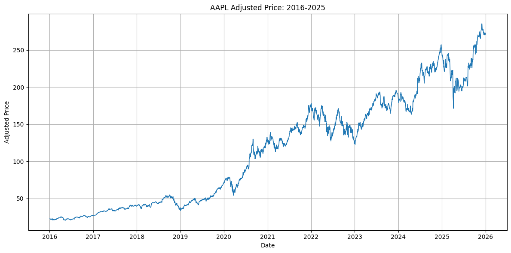
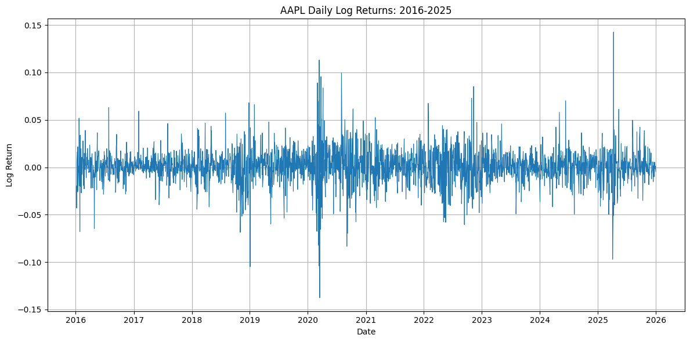
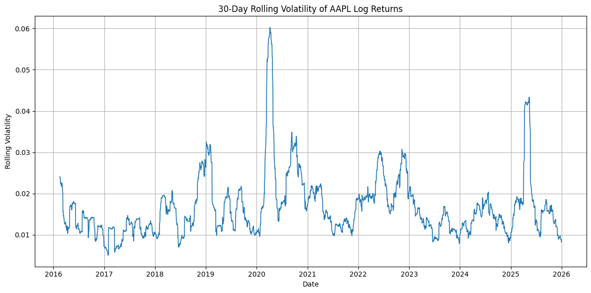
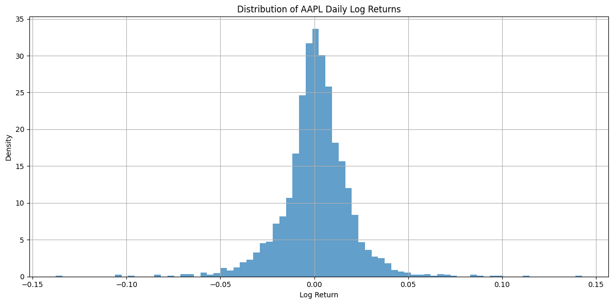
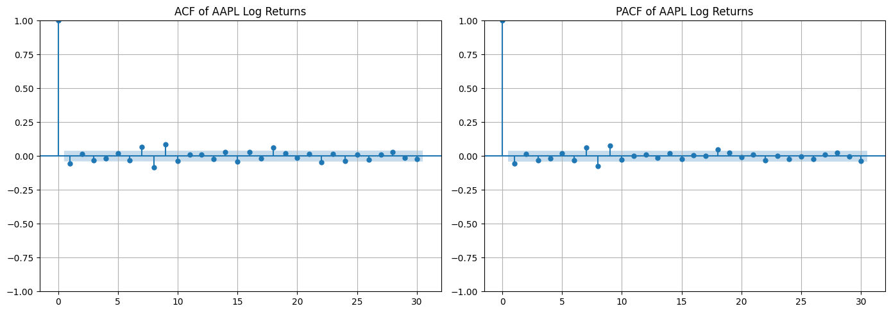
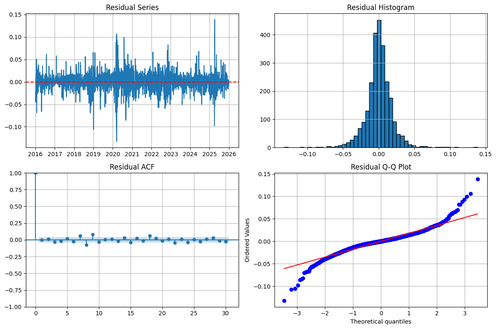
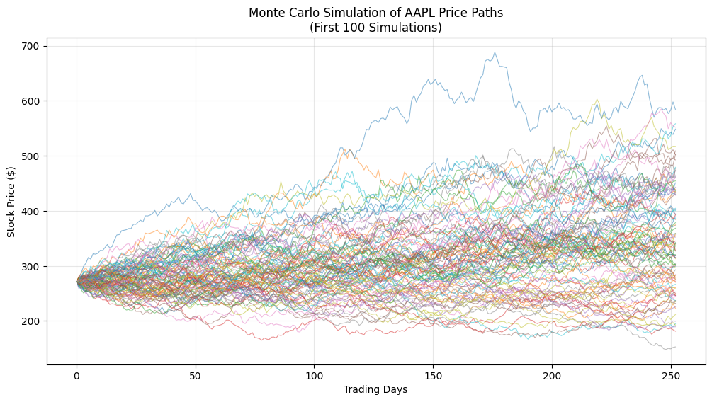
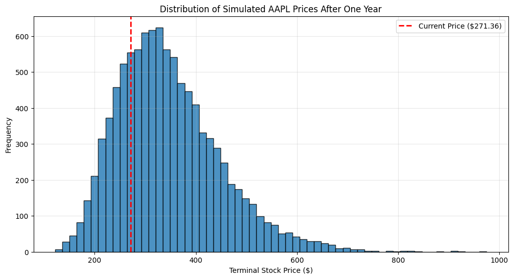
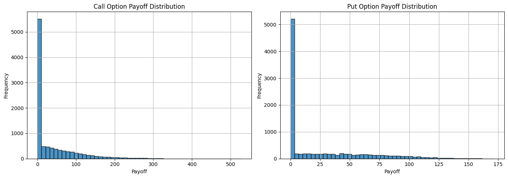

# AAPL Quantitative Pricing Tool

[](https://www.python.org/)
[](https://jupyter.org/)
[]()
[]()
[]()

A Python-based computational finance project using **Apple Inc. (AAPL)** as a case study for time-series analysis, market simulation, and European option valuation.

## Project Overview

This project develops an end-to-end quantitative pricing workflow. Historical AAPL data are cleaned and transformed into log returns, statistical properties are examined, an ARIMA benchmark is estimated, and future price scenarios are generated using Geometric Brownian Motion and Monte Carlo simulation.

European call and put options are then valued under risk-neutral assumptions. The Monte Carlo prices are compared with the analytical Black–Scholes model to assess implementation consistency under GBM assumptions.

> **Important:** The simulation does not provide a guaranteed stock-price forecast. It generates a distribution of possible outcomes under the selected model assumptions.

## Workflow

```text
Historical AAPL Data
        ↓
Data Cleaning and Adjusted Prices
        ↓
Log Returns and Exploratory Analysis
        ↓
ADF Stationarity Test
        ↓
ARIMA(1,0,0) Benchmark
        ↓
GBM Parameter Estimation
        ↓
10,000 Monte Carlo Price Paths
        ↓
European Call and Put Valuation
        ↓
Black–Scholes Validation
```

## Methods

- Historical adjusted-price analysis
- Simple and logarithmic return calculation
- Descriptive statistics and normality testing
- Augmented Dickey–Fuller stationarity test
- ACF and PACF analysis
- ARIMA model comparison using AIC
- Geometric Brownian Motion
- Monte Carlo simulation with 10,000 paths
- Risk-neutral European option pricing
- Black–Scholes benchmark comparison

## Selected Results

| Metric | Result |
|---|---:|
| Sample period | 2016–2025 |
| Observations | 2,513 |
| Last observed AAPL price | $271.36 |
| Annualized historical return | 24.44% |
| Annualized volatility | 29.02% |
| Mean simulated terminal price | $345.67 |
| Monte Carlo call price | $36.48 |
| Black–Scholes call price | $36.95 |
| Call pricing difference | 1.27% |
| Monte Carlo put price | $25.19 |
| Black–Scholes put price | $25.01 |
| Put pricing difference | 0.70% |

The relatively small differences between Monte Carlo and Black–Scholes prices indicate that the numerical implementation is consistent with the analytical benchmark under the shared GBM assumptions.

## Visual Results

### Historical AAPL Price



### Daily Log Returns and Volatility





### Return Distribution



### ARIMA Diagnostics





### Monte Carlo Simulation





### Option Payoff Distributions



## Repository Structure

```text
AAPL-Quantitative-Pricing-Tool/
├── AAPL_Option_Pricing.ipynb
├── README.md
├── requirements.txt
├── .gitignore
└── images/
    ├── aapl_adjusted_price.png
    ├── aapl_log_returns.png
    ├── aapl_return_distribution.png
    ├── aapl_rolling_volatility.png
    ├── aapl_acf_pacf.png
    ├── arima_residual_diagnostics.png
    ├── monte_carlo_paths.png
    ├── terminal_price_distribution.png
    └── option_payoff_distributions.png
```

## Installation

Clone the repository:

```bash
git clone https://github.com/fatemetoori740109-ui/AAPL-Quantitative-Pricing-Tool.git
cd AAPL-Quantitative-Pricing-Tool
```

Install the required packages:

```bash
pip install -r requirements.txt
```

Launch Jupyter Notebook:

```bash
jupyter notebook AAPL_Option_Pricing.ipynb
```

## Technologies

- Python
- Jupyter Notebook
- Pandas
- NumPy
- Matplotlib
- SciPy
- Statsmodels
- yfinance

## Model Limitations

- GBM assumes constant drift and volatility.
- Financial returns may exhibit fat tails and volatility clustering.
- ARIMA captures linear time dependence but does not model changing conditional volatility.
- Black–Scholes validation confirms numerical consistency under common assumptions; it does not prove that real markets perfectly follow GBM.
- Results depend on the selected sample period and parameter assumptions.

## Possible Future Improvements

- GARCH-type models for time-varying volatility
- Alternative stochastic-volatility models
- Additional equities and portfolio-level analysis
- Interactive dashboard or web application
- Out-of-sample testing and model comparison

## Authors

**Fatemeh Touri**  
M.Sc. Financial Economics  
Otto von Guericke University Magdeburg

**Ooreoluwa Mary Adeyemi**  
Project collaborator

## Academic Use

This repository presents a university project for educational and portfolio purposes. It does not provide investment advice.
